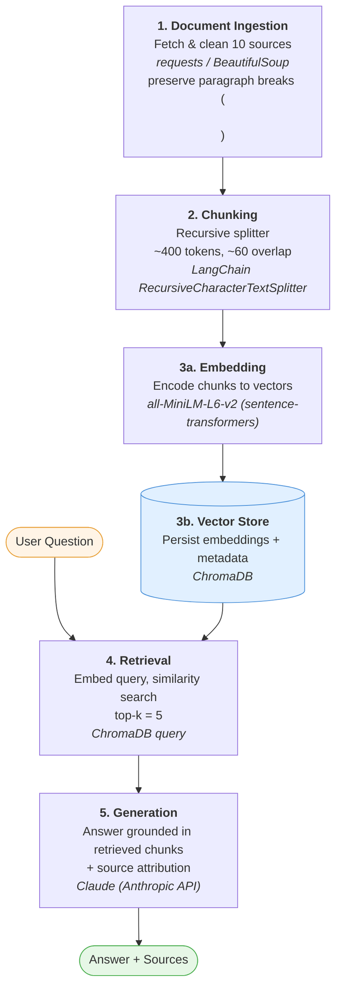

# Project 1 Planning: The Unofficial Guide

> Write this document before you write any pipeline code.
> Your spec and architecture diagram are what you'll use to direct AI tools (Claude, Copilot, etc.) to generate your implementation — the more specific they are, the more useful the generated code will be.
> Update the Retrieval Approach and Chunking Strategy sections if you change your approach during implementation.
> Update this file before starting any stretch features.

---

## Domain
<!-- What domain did you choose? Why is this knowledge valuable and hard to find through official channels? -->
**RPI Campus Dining Experience**

My chosen domain is RPI's campus dining experience. This knowledge is hard to find because food options are publicly visible on the school's website, however, the dining experience are typically provided by the students who are attending or who have attended the university, or the people who live around the areas, and the reviews are typically scattered across the internet, therefore it's necessary to search for all information and piece them together.

---

## Documents

<!-- List your specific sources: URLs, subreddit names, forum threads, or file descriptions.
     Aim for at least 10 sources that together cover different subtopics or perspectives within your domain. -->

| # | Source | Description | URL or location |
|---|--------|-------------|-----------------|
| 1 |  Reddit Post | A Massive List of Restaurants in the RPI Area | https://www.reddit.com/r/RPI/comments/1kar67/a_massive_list_of_restaurants_in_the_rpi_area/ |
| 2 | Facebook Post | Here's a look inside the newly renovated Commons Dining Hall | https://www.facebook.com/RPI.EDU/posts |
| 3 | wonstudy.com | Russell Sage Dining Hall: A Culinary Oasis in the Heart of Troy | https://wonstudy.com/russell-sage-dining-hall-a-culinary-oasis-in-the-heart-of-troy/ |
| 4 | The Brain Blog | RPI Dining Hours: Your Ultimate 2024 Guide for Every Hall | https://the-brain.blog/rpi-dining-hours-ultimate-2024-guide-every-hall-15149/ |
| 5 | University News Article | Campus dining follow-up: Lally Galley proves decent | https://poly.rpi.edu/features/2013/02/2013-02-20-campus-dining-follow-up-lally-galley-proves-decent |
| 6 | Niche | Rensselaer Polytechnic Institute Reviews | https://www.niche.com/colleges/rensselaer-polytechnic-institute/reviews/ |
| 7 | Reddit Post | How's the food | https://www.reddit.com/r/RPI/comments/zrnqys/hows_the_food/ |
| 8 | University Magazine | Food for Thought | https://magazine.rpi.edu/feature/food-for-thought |
| 9 | Online Forum | RPI neighborhood | https://talk.collegeconfidential.com/t/rpi-neighborhood/1974021 |
| 10 | University News Article | RPI's failure to feed | https://poly.rpi.edu/opinion/2023/04/rpi-failure-to-feed |

---

## Chunking Strategy

<!-- How will you split documents into chunks?
     State your chunk size (in tokens or characters), overlap size, and explain why those
     numbers fit the structure of your documents.
     A review-heavy corpus warrants different chunking than a long FAQ. -->
     I would consider to chunk in token size, I'm considering fixed size chunk, or recursive chunking strategy

**Chunk size:**

~400 Tokens

**Overlap:**

~50-75 tokens

**Reasoning:**

Most of my documents or sources are reviews or comments that are formed in paragraph forms. I believe this size provides cleaner, more precise embedding and less off-topic noise per retrieval

---

## Retrieval Approach

<!-- Which embedding model are you using (e.g., all-MiniLM-L6-v2 via sentence-transformers)?
     How many chunks will you retrieve per query (top-k)?
     If you were deploying this for real users and cost wasn't a constraint, what tradeoffs
     would you weigh in choosing a different embedding model — context length, multilingual
     support, accuracy on domain-specific text, latency? -->

**Embedding model:**

all-MiniLM-L6-v2 via sentence-transformers

**Top-k:**

5

**Production tradeoff reflection:**

If I were deploying this for real users and cost wasn't a constraint, I would consider the tradeoffs on context length, accuracy on domain-specific text, and latency when using different models, since these are key factors users value the most when interacting with RAG systems or AI Models

---

## Evaluation Plan

<!-- List your 5 test questions with their expected correct answers.
     Questions should be specific enough that you can judge whether the system's response
     is right or wrong. "What are good dining halls?" is too vague.
     "What do students say about wait times at [dining hall name] during lunch?" is testable. -->

| # | Question | Expected answer |
|---|----------|-----------------|
| 1 | What do students say about the peak hours at Russell Sage? | The absolute busiest time at Sage is usually weekdays between 12:00 PM and 1:00 PM for lunch. Dinner rush also tends to pick up right at 5:00 PM. (from The-Brain.blog)|
| 2 | What do university staff say about BARH Dining Hall's food menu focus area? | A registered dietitian-nutritionist and dietitian for Rensselaer Dining Services shared that  dining hall has always been leaned on performance-based menus. But now the menus are focused on foods that enhance optimal athletic and mental performance  (from RPI Alumni Magazine)|
| 3 | Does Russell Sage Dining Hall accomodate to dietary needs? | Yes, The dining hall staff is well-versed in allergen identification and can assist diners with any dietary restrictions. The menu clearly labels all dishes with common allergens, and special dietary requests can be accommodated upon request. (from wonstudy.com)|
| 4 | Which two pizza restaurants near the campus area are the most popular among RPI students, and how are they compared? | Big Apple Pizza (Pizza Bella) and Defazios are mentioned by students being the two most popular pizza places. The comparison is described as similar to a "Mac vs. PC" debate, with the recommendation that students try both and decide for themselves. (from Reddit ) |
| 5 | Which one of the restaurants do students recommend are especially good choices for weekend breakfasts? | For weekend breakfasts, students recommend Manory's, praising its accommodating service for groups and breakfast specials. (from Reddit) |

---

## Anticipated Challenges

<!-- What could go wrong? Name at least two specific risks with reasoning.
     Consider: noisy or inconsistent documents, missing source attribution, off-topic
     retrieval, chunks that split key information across boundaries. -->

1. The off-topic retrieval might be a problem because the documents involved a lot of general discussions about the university, not just about campus dining experience.

2. Chunks that split key information across boundaries might be a problem because the the length of my documents vary so it could break some documents into chunks with incomplete sentences or information.

---

## Architecture

<!-- Draw a diagram of your pipeline showing the five stages:
     Document Ingestion → Chunking → Embedding + Vector Store → Retrieval → Generation
     Label each stage with the tool or library you're using.
     You can use ASCII art, a Mermaid diagram, or embed a sketch as an image.
     You'll use this diagram as context when prompting AI tools to implement each stage. -->

---

## AI Tool Plan

<!-- For each part of the pipeline below, describe:
     - Which AI tool you plan to use (Claude, Copilot, ChatGPT, etc.)
     - What you'll give it as input (which sections of this planning.md, which requirements)
     - What you expect it to produce
     - How you'll verify the output matches your spec

     "I'll use AI to help me code" is not a plan.
     "I'll give Claude my Chunking Strategy section and ask it to implement chunk_text()
     with my specified chunk size and overlap" is a plan. -->

**Milestone 3 — Ingestion and chunking:**
I'll provide Claude Code my chunking strategy section as well as the document section, ask it to implement the ingestion_text() and chunk_text () with my provided documents and my specified chunk size and overlap. I'll verify the output to check if it matches against my specification

**Milestone 4 — Embedding and retrieval:**
I'll provide Claude Code my Retrieval section, with the embedding model, and top k decision, as well as my trade off reflection ask it to implement the embedding_vector() and retrieval_to_generation () function with the information provided from the sections. I'll verify the output to check if it matches against my specification

**Milestone 5 — Generation and interface:**
I'll provide Claude Code my Eveluation Plan section, ask it to implement the generate_answer () function with the information provided from the sections. I'll verify the output to check if it matches against my specification
